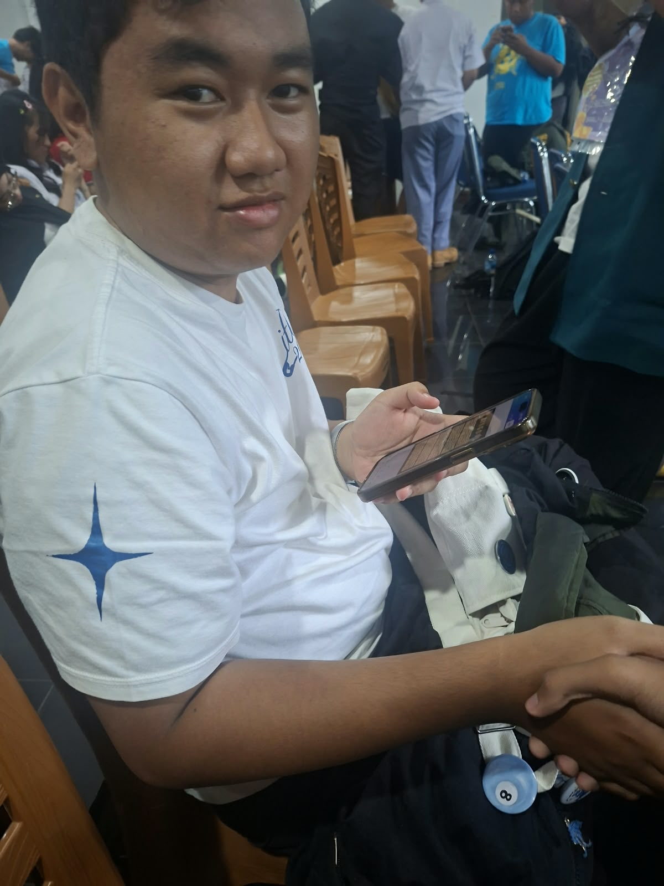

## Kompetensi target

Melakukan personal conversation dengan listening, clarity, boundary, dan relationship awareness.

## Evidence wajib

- Transcript atau catatan percakapan.
- Evidence listening dan response.
- Analisis relationship state sebelum dan sesudah.

::: {.callout-tip title="Lihat contoh pengisian"}
[Buka contoh fiktif Minggu 3](../examples/week-03.qmd) untuk melihat tingkat kekonkretan evidence dan analisis. Jangan menyalin contoh sebagai evidence pribadi.
:::

## Konteks performance

**Tanggal dan setting:** 12 September 2026, di ruang diskusi kampus setelah sesi latihan berpasangan. Percakapan dilakukan secara langsung selama sekitar 10 menit, lalu saya dan mitra mencatat umpan balik singkat.

**Persons dan relationship:** Saya sebagai pendengar dan Fakhri Athallah Dwi Andeo sebagai mitra latihan sekaligus teman satu tim. Nama digunakan karena mitra menyetujui dokumentasi evidence ini.

**Objective dan initial state:** Tujuan saya adalah memahami keresahan Fakhri tentang tugas presentasi kelompok tanpa langsung memperbaiki atau memberi saran. State awal percakapan cukup tegang: Fakhri lelah karena dua anggota belum mengirim bahan, sementara saya memiliki kebiasaan spontan menawarkan solusi.

## Evidence

::: {.evidence-block}

Gambar di atas adalah dokumentasi sesi latihan. Kontribusi saya adalah menyiapkan percakapan, mendengarkan tanpa memotong, mengajukan pertanyaan terbuka, melakukan parafrasa, dan mencatat umpan balik mitra. Catatan percakapan dan refleksi berikut ditulis segera setelah sesi.

**Potongan transcript:**

> **Fakhri:** “Dua anggota belum mengirim bahan sampai sehari sebelum latihan. Akhirnya sebagian besar slide saya susun sendiri malam itu.”
>
> **Saya:** “Bagian mana yang paling membuatmu merasa berat?”
>
> **Fakhri:** “Saya capek karena tidak tahu apakah bagian mereka akan selesai. Saya juga takut presentasinya berantakan.”
>
> **Saya:** “Kalau aku menangkapnya dengan benar, yang paling membuatmu berat bukan hanya jumlah slide, tetapi kamu merasa memikul tanggung jawab kelompok sendirian dan belum mendapat kepastian tentang peran anggota lain. Apakah benar begitu?”
>
> **Fakhri:** “Iya, itu yang paling mengganggu.”
>
> **Saya:** “Sepertinya kamu cemas dan kecewa karena butuh pembagian tugas yang jelas serta dukungan yang adil. Apakah saat ini kamu ingin didengarkan saja, dibantu memetakan pilihan, atau memerlukan saran dariku?”
>
> **Fakhri:** “Aku ingin didengarkan dulu, lalu dibantu memetakan pilihan. Belum perlu saran langsung.”
:::

## Analisis komunikasi

| Elemen | Evidence dan analisis |
|---|---|
| Person & character | Fakhri hadir sebagai teman satu tim yang lelah, cemas, dan tetap bertanggung jawab terhadap presentasi. Saya mengenali kecenderungan diri sebagai “problem solver” yang ingin segera memberi solusi, lalu sengaja mengambil peran pendengar. |
| Objective & state | Objective saya adalah membuat Fakhri merasa dipahami sebelum membahas tindakan. State awalnya tegang dan tidak pasti; setelah parafrasa, kebutuhan utama menjadi lebih jelas dan percakapan terasa lebih aman. |
| Repertoire & language | Saya memakai kontak mata, anggukan, dua pertanyaan terbuka, parafrasa, dan tebakan emosi dengan bahasa tentatif (“sepertinya” dan “apakah”). Saya menghindari label seperti “kamu tidak tegas” atau “anggota lain malas”. |
| Response & adaptation | Saya sempat hampir berkata, “langsung tegur saja mereka.” Setelah menyadari itu akan mengambil alih percakapan, saya berhenti, meminta maaf, dan kembali ke pertanyaan tentang kebutuhan Fakhri. |
| Agreement/action | Sesuai permintaan Fakhri, tindakan pertama adalah mendengarkan lalu memetakan pilihan. Pilihan yang muncul: membagi ulang bagian yang belum selesai, menetapkan batas waktu internal, dan mengonfirmasi kesiapan anggota sebelum latihan berikutnya. |
| Relationship outcome | Fakhri mengatakan ia merasa didengarkan karena saya tidak memotong dan mampu menangkap inti bebannya. Ketegangan percakapan menurun; kami memiliki dasar untuk melakukan check-in pembagian tugas tanpa saling menyalahkan. |

## Penggunaan AI

Saya menggunakan AI untuk merapikan program/dokumen portofolio dan membantu menyusun kalimat agar urutan evidence lebih jelas. Prompt pentingnya adalah meminta bantuan merapikan struktur tulisan tanpa mengubah fakta pengalaman, nama mitra, tanggal, atau isi percakapan. Saya menggunakan hasil yang hanya memperjelas tata bahasa dan format, lalu mengubah kembali bagian yang tidak sesuai dengan pengalaman. Saya menolak tambahan fakta, dialog, atau emosi yang tidak saya ingat terjadi. Pemeriksaan accuracy dilakukan dengan mencocokkan teks dengan catatan latihan; pemeriksaan privacy dilakukan dengan membatasi data pada nama yang memang diminta untuk dokumentasi; dan authority tetap pada pengalaman saya serta konfirmasi Fakhri, bukan pada AI. Yang tetap saya pelajari sebagai manusia adalah cara hadir, menahan dorongan memberi solusi, membaca kebutuhan, dan memperbaiki respons secara langsung.

## Feedback dan tindak lanjut

**Feedback yang diterima:** Fakhri mengatakan ia paling merasa didengarkan ketika saya menaruh gawai, mengangguk, tidak memotong, dan mengulang inti masalahnya dengan kalimat “memikul tanggung jawab kelompok sendirian”. Ia juga menunjukkan bahwa saya sempat terburu-buru ketika mulai menyarankan untuk langsung menegur anggota lain.

**Adaptation/replay:** Saya meminta maaf, menghapus saran tersebut dari respons awal, lalu mengulang bagian akhir dengan pertanyaan kebutuhan. Setelah replay, Fakhri memilih didengarkan terlebih dahulu dan baru memetakan pilihan tindakan.

**Next practice:** Dalam percakapan keluarga atau sahabat berikutnya, saya akan menahan saran selama lima menit pertama, membuat satu parafrasa, dan menanyakan jenis bantuan yang diinginkan sebelum mengusulkan tindakan.

## Self-assessment

| Dimensi | Skor 1–4 | Evidence singkat |
|---|---:|---|
| Person & Character | 3 | Kebutuhan Fakhri dan kecenderungan saya sebagai problem solver dikenali. |
| Objective & State | 3 | Tujuan mendengarkan dan perubahan state tegang menjadi lebih aman dijelaskan. |
| Repertoire, Language & AI | 3 | Pertanyaan terbuka, parafrasa, validasi tentatif, dan batas penggunaan AI terdokumentasi. |
| Response & Adaptation | 3 | Saya menghentikan dorongan memberi solusi dan melakukan replay. |
| Agreement, Action & Relationship | 3 | Pilihan tindakan disusun sesuai kebutuhan Fakhri dan hubungan kerja tetap terjaga. |

**Total:** 15 / 20

::: {.assessor-only}
### Assessment dosen

**Skor:** — / 20  
**Evidence yang mendukung:** —  
**Prioritas perbaikan:** —  
**Keputusan:** Belum dinilai / Perlu revisi / Tercapai
:::
